# 🚀 Despliegue de Windows Server 2022 y Active Directory

Este manual documenta el proceso técnico integral para crear un entorno de servidor profesional, desde la virtualización hasta la configuración de un Dominio de Active Directory.

---

## 📂 Fase 01: Configuración de la Máquina Virtual (VirtualBox)
El primer paso fundamental es preparar el hardware virtual donde se alojará nuestro servidor. Una asignación correcta de recursos garantiza la estabilidad de los servicios de identidad.

### Paso 1.1: Creación y Ajustes de la VM
Se configura una máquina virtual con los siguientes parámetros técnicos:
* **Sistema Operativo:** Windows 2022 (64-bit).
* **Memoria RAM:** 4 GB (Mínimo recomendado para entorno gráfico y AD DS).
* **Procesador:** 2 núcleos de CPU para evitar latencia en procesos de fondo.
* **Red:** Modo Adaptador Puente para integración en la LAN.

---

## 📂 Fase 02: Instalación del Sistema Operativo
En esta etapa se realiza la instalación limpia de Windows Server 2022. Es el proceso donde se define la edición del servidor y se prepara el almacenamiento.

### Paso 2.1: Selección de Idioma y Comienzo
Se inicia el asistente de instalación configurando el idioma y el método de entrada del teclado.

### Paso 2.2: Edición del Sistema
Se selecciona la versión **Windows Server 2022 Standard (Experiencia de escritorio)**. Esta versión es fundamental para este laboratorio ya que incluye la interfaz gráfica (GUI) necesaria para la administración visual.

### Paso 2.3: Configuración de Almacenamiento
Se realiza una instalación de tipo "Personalizada" para gestionar las particiones. Se asigna la totalidad del espacio del disco duro virtual creado previamente.

### Paso 2.4: Configuración de Seguridad Inicial
Tras el primer arranque, se establece la contraseña de la cuenta de **Administrador**. Esta cuenta será, posteriormente, la que tenga privilegios totales sobre el dominio.
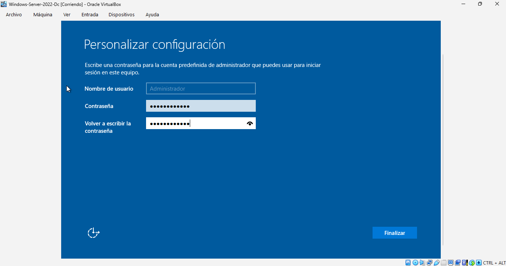

### Paso 2.5: Primer Inicio de Sesión
Verificación del escritorio de Windows Server 2022 y apertura automática del Administrador del Servidor para comenzar las tareas de configuración.

---

## 📂 Fase 03: Instalación de Guest Additions
Las *Guest Additions* de VirtualBox son esenciales para optimizar el rendimiento del servidor virtual, permitiendo una mejor resolución de pantalla y el uso de funciones compartidas.

### Paso 3.1: Montaje de la imagen de CD
Se utiliza la opción del menú de VirtualBox para insertar el disco virtual de las Guest Additions en la unidad óptica del servidor.
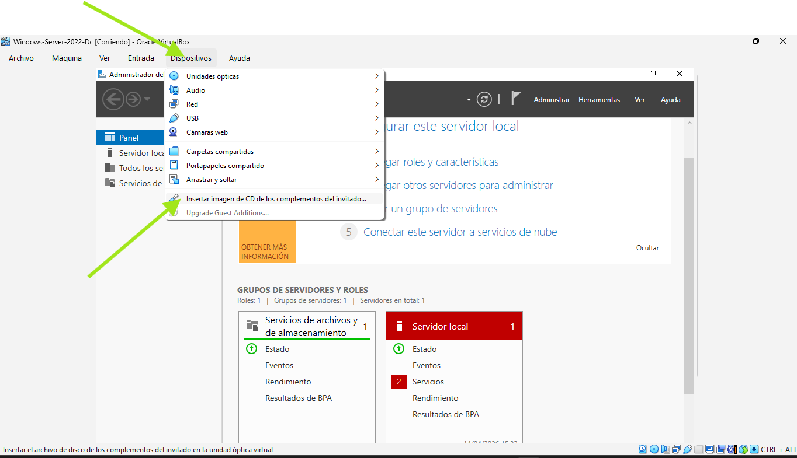

### Paso 3.2: Ejecución del instalador
Se accede a la unidad de CD montada y se ejecuta el asistente de instalación para los drivers de Windows.
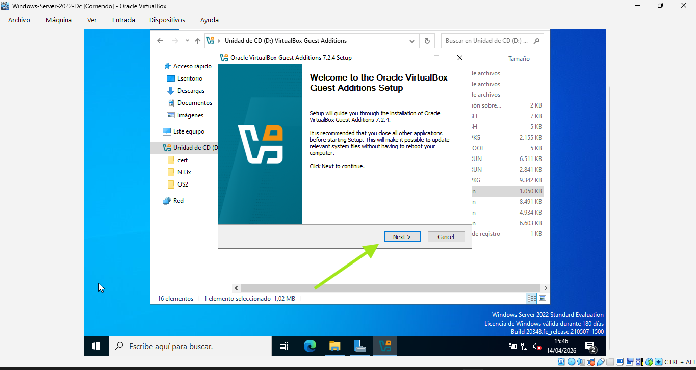

### Paso 3.3: Instalación de controladores
El asistente instala los controladores de vídeo, ratón y sistema necesarios para la integración con el host.
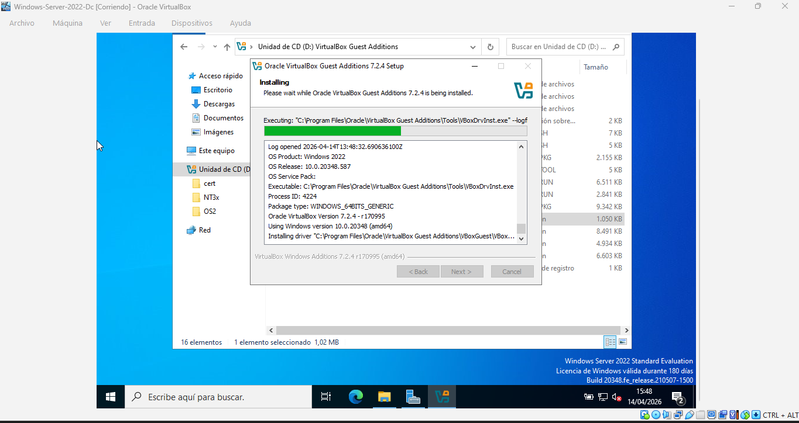

### Paso 3.4: Finalización y Reinicio
Una vez completada la instalación, se requiere un reinicio del servidor para que los nuevos controladores se carguen correctamente.
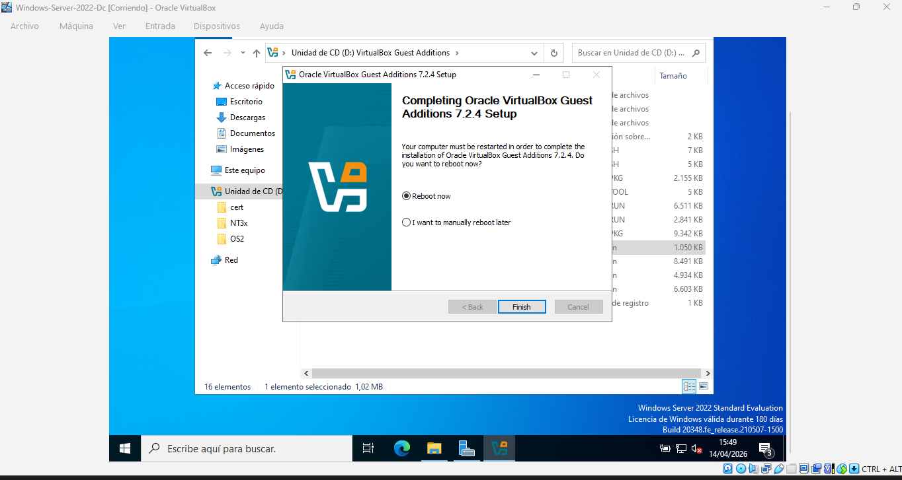

---

## 📂 Fase 04: Configuración de Red (IP Estática)
Para que un Controlador de Dominio funcione correctamente, debe tener una dirección IP fija. Esto evita que los clientes pierdan la conexión con los servicios de autenticación y DNS.

### Paso 4.1: Acceso a las conexiones de red
Se accede al Centro de redes y recursos compartidos para gestionar el adaptador Ethernet virtual.
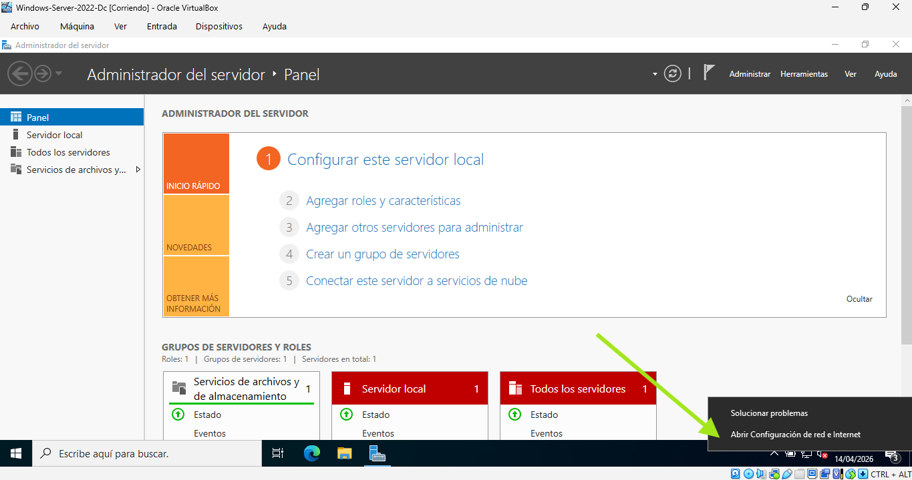

### Paso 4.2: Propiedades de IPv4
Dentro de las propiedades del adaptador, se selecciona el protocolo **Internet Protocol Version 4 (TCP/IPv4)** para su edición.
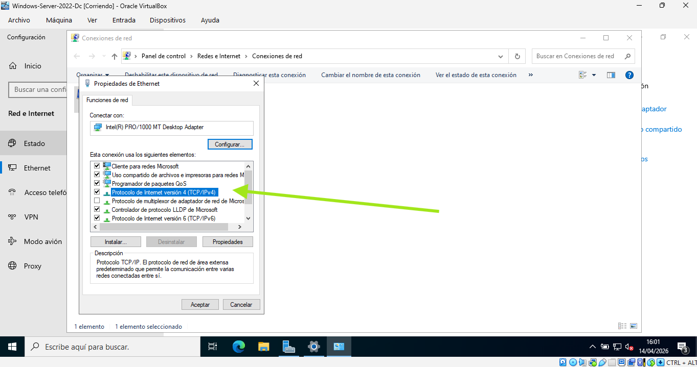

### Paso 4.3: Asignación de parámetros técnicos
Se configura la siguiente dirección estática para asegurar la persistencia del servidor en la red:
* **Dirección IP:** 192.168.1.3
* **Máscara de subred:** 255.255.255.0
* **Puerta de enlace:** 192.168.1.1
* **DNS:** Se establece inicialmente la IP local.
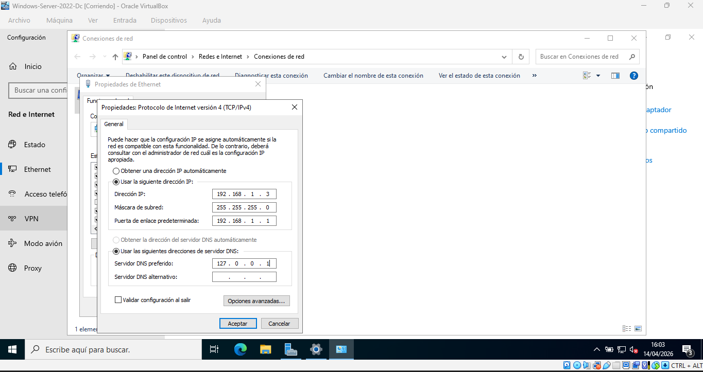

---

## 📂 Fase 05: Identidad del Servidor (Hostname)
Antes de promocionar el servidor a Controlador de Dominio, es una buena práctica asignar un nombre descriptivo y estandarizado al equipo.

### Paso 5.1: Verificación del nombre actual
Se accede a las propiedades del sistema para identificar el nombre aleatorio asignado por Windows durante la instalación.
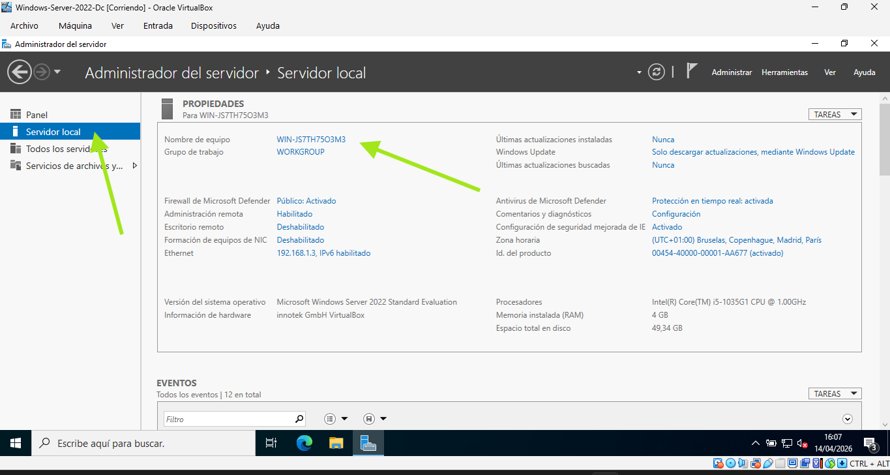

### Paso 5.2: Cambio de nombre a DC1
Se modifica el nombre del equipo a **DC1** (Domain Controller 1), facilitando su identificación en la red.
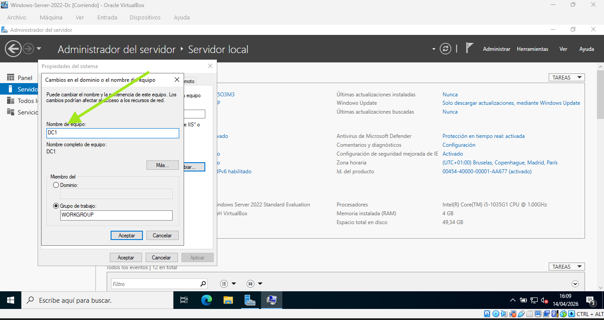

### Paso 5.3: Reinicio del sistema
Para que el cambio de nombre sea efectivo, se procede con el reinicio obligatorio del servidor.
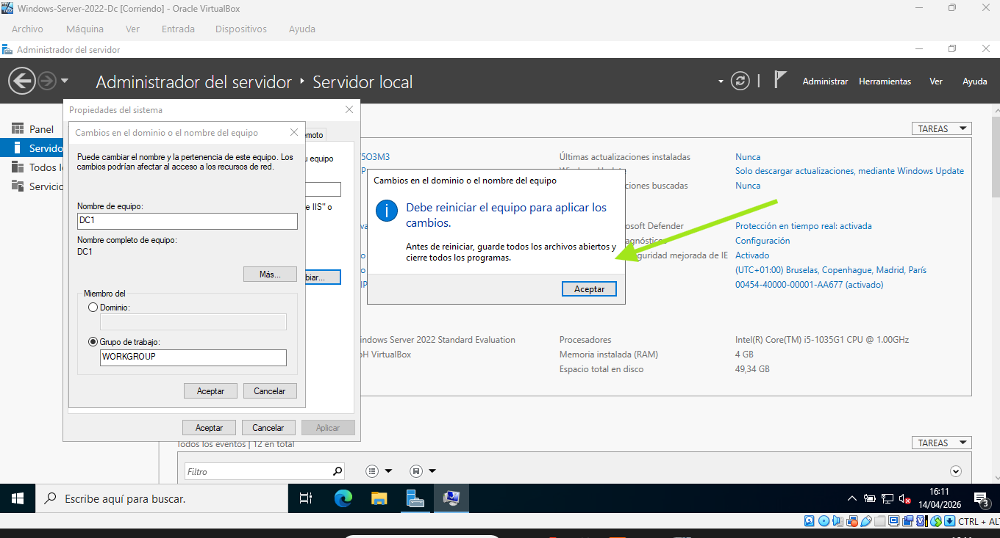

---

## 📂 Fase 06: Instalación del Rol AD DS
En esta fase se preparan los binarios del sistema para convertir el servidor en un Controlador de Dominio. Se utiliza el asistente para agregar roles y características del Administrador del Servidor.

### Paso 6.1: Inicio del asistente
Se accede al asistente para agregar roles, asegurando que el servidor de destino sea **DC1**.
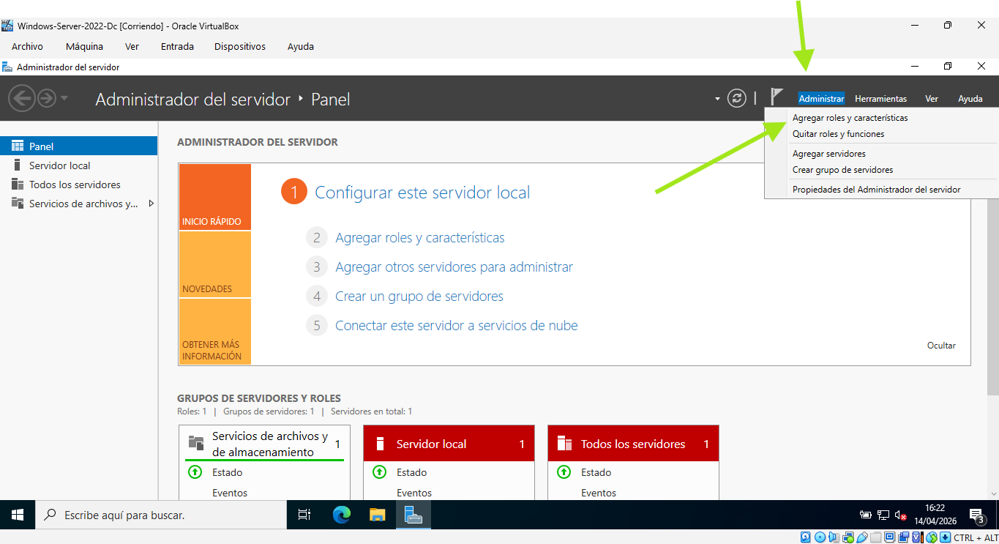

### Paso 6.2: Selección del Rol
Se marca la casilla **Servicios de dominio de Active Directory (AD DS)**. El sistema solicitará automáticamente la instalación de las herramientas de administración necesarias.
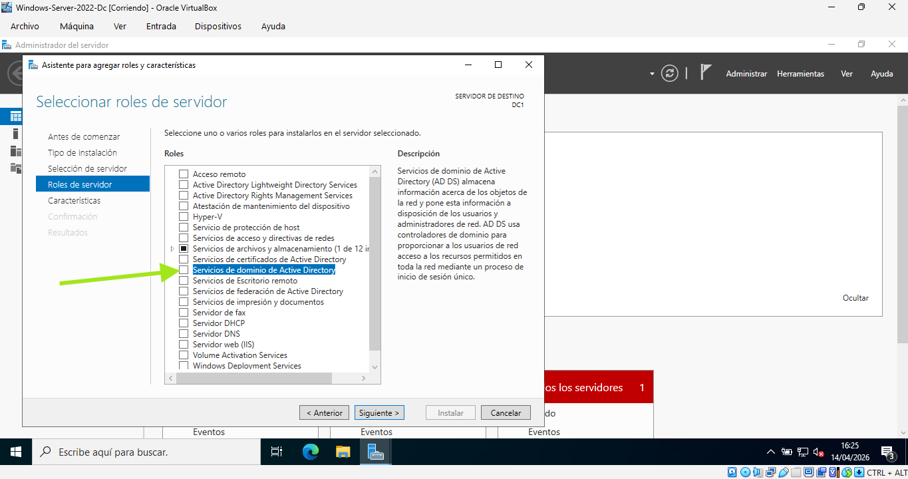

### Paso 6.3: Confirmación de características
Se verifican las características adicionales, como las herramientas de administración remota de servidor (RSAT), esenciales para gestionar el dominio.
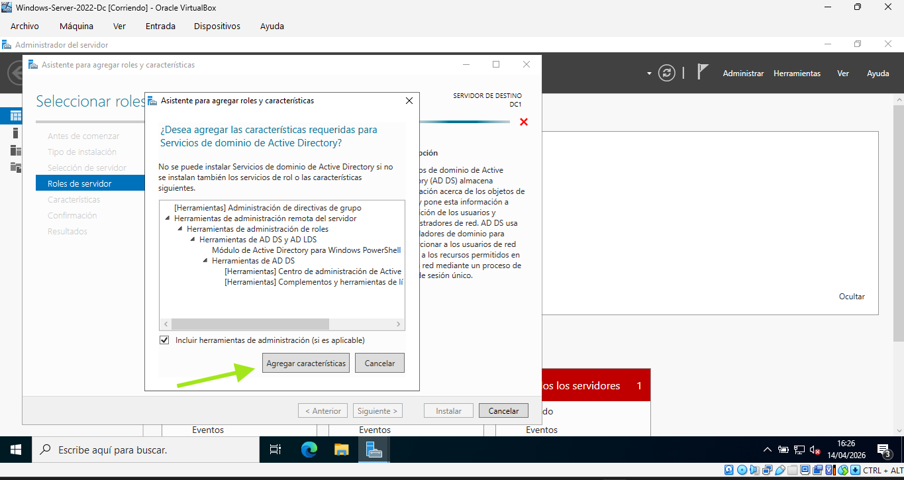

### Paso 6.4: Progreso y Finalización
Se inicia la instalación de los binarios. Al finalizar, el sistema indica que la instalación ha sido correcta pero que queda pendiente la promoción del servidor a controlador.
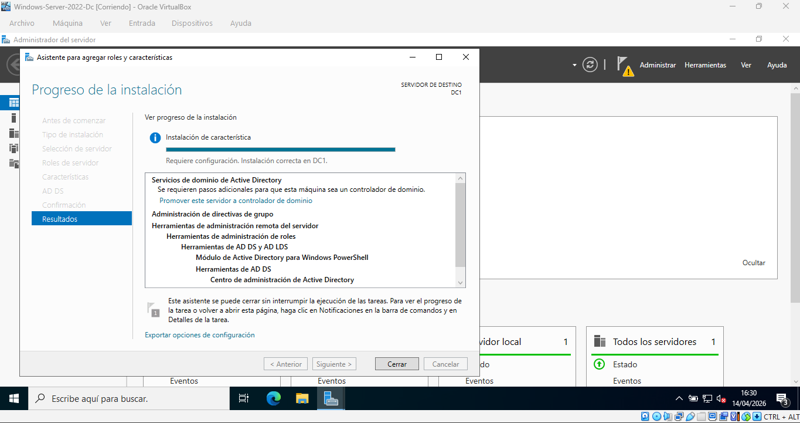

