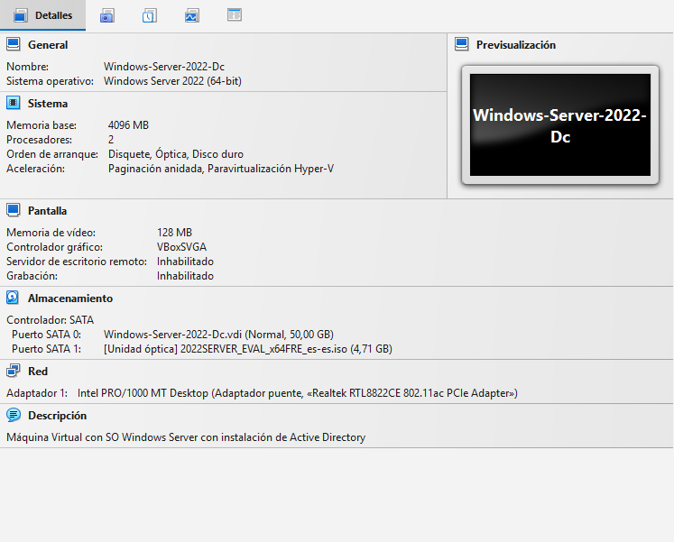
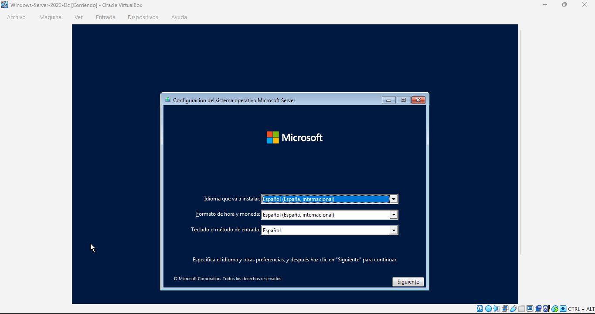
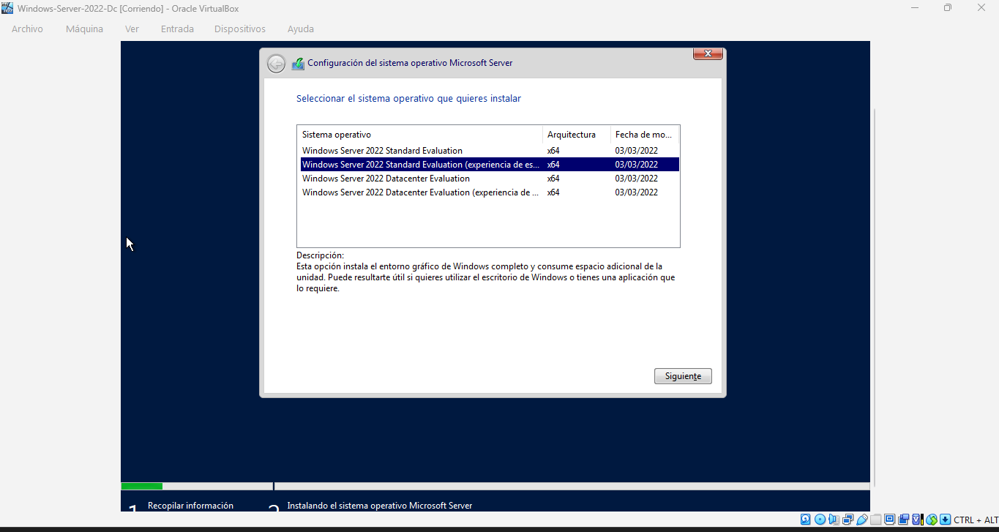
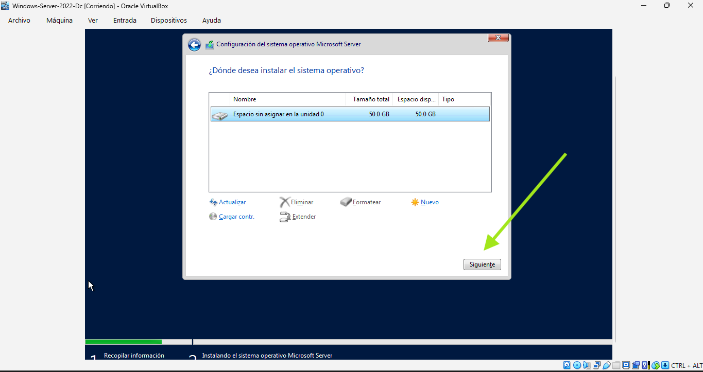
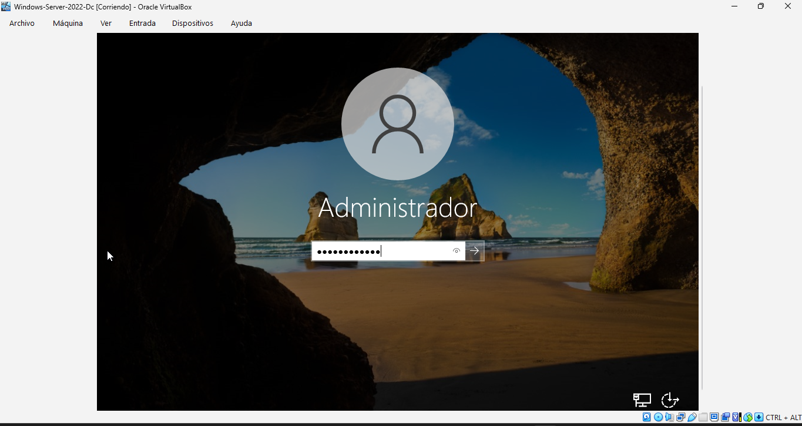

# 🚀 Despliegue de Windows Server 2022 y Active Directory

Este manual documenta el proceso técnico integral para crear un entorno de servidor profesional, desde la virtualización hasta la configuración de un Dominio de Active Directory.

---

## 📂 Fase 01: Configuración de la Máquina Virtual (VirtualBox)
El primer paso fundamental es preparar el hardware virtual donde se alojará nuestro servidor. Una asignación correcta de recursos garantiza la estabilidad de los servicios de identidad.

### Paso 1.1: Creación y Ajustes de la VM
Se configura una máquina virtual con los siguientes parámetros técnicos:
* **Sistema Operativo:** Windows 2022 (64-bit).
* **Memoria RAM:** 4 GB (Mínimo recomendado para entorno gráfico y AD DS).
* **Procesador:** 2 núcleos de CPU para evitar latencia en procesos de fondo.
* **Red:** Modo Adaptador Puente para integración en la LAN.

---

## 📂 Fase 02: Instalación del Sistema Operativo
En esta etapa se realiza la instalación limpia de Windows Server 2022. Es el proceso donde se define la edición del servidor y se prepara el almacenamiento.

### Paso 2.1: Selección de Idioma y Comienzo
Se inicia el asistente de instalación configurando el idioma y el método de entrada del teclado.

### Paso 2.2: Edición del Sistema
Se selecciona la versión **Windows Server 2022 Standard (Experiencia de escritorio)**. Esta versión es fundamental para este laboratorio ya que incluye la interfaz gráfica (GUI) necesaria para la administración visual.

### Paso 2.3: Configuración de Almacenamiento
Se realiza una instalación de tipo "Personalizada" para gestionar las particiones. Se asigna la totalidad del espacio del disco duro virtual creado previamente.

### Paso 2.4: Configuración de Seguridad Inicial
Tras el primer arranque, se establece la contraseña de la cuenta de **Administrador**. Esta cuenta será, posteriormente, la que tenga privilegios totales sobre el dominio.

### Paso 2.5: Primer Inicio de Sesión
Verificación del escritorio de Windows Server 2022 y apertura automática del Administrador del Servidor para comenzar las tareas de configuración.

